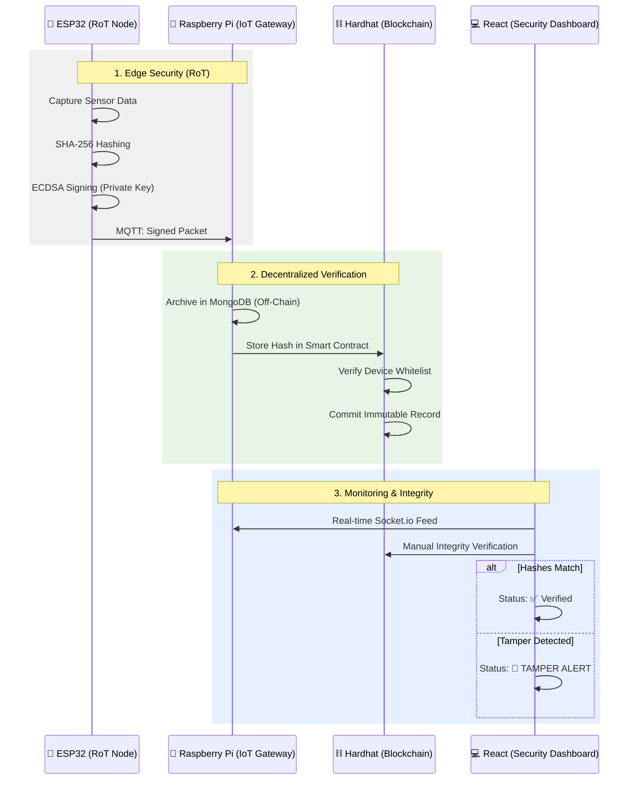

# 🛡️ Hybrid IoT Security with Blockchain & Root of Trust (RoT)

This repository contains the complete implementation of a multi-layered security framework for IoT systems. The project integrates hardware-level security (ESP32), a local intelligent gateway (Raspberry Pi), and a decentralized verification ledger (Ethereum/Hardhat) to ensure data integrity and device authenticity.

---

## 🌟 Project Overview

The core objective of this FYP is to prevent **data tampering** and **device spoofing** in IoT networks. By combining "Root of Trust" (RoT) on the edge with Blockchain immutability on the backend, we create a system where every sensor reading is cryptographically signed and verified before being trusted by the user.

### 🏗 System Architecture



---

## 📂 Project Structure

This repository is organized into four main modules:

| Module | Description | Tech Stack |
| :--- | :--- | :--- |
| [**`esp32`**](./esp32) | Secure edge node implementation. | C++, mbedTLS, MQTT |
| [**`iot-gateway`**](./iot-gateway) | Intelligent bridge & data processor. | Node.js, MongoDB, Socket.io |
| [**`security-blockchain`**](./security-blockchain) | Smart contracts & authorization. | Solidity, Hardhat, Ethers.js |
| [**`iot-security-dashboard`**](./iot-security-dashboard) | Admin monitoring & verification UI. | React 19, Vite, Tailwind CSS |

---

## 🚀 Quick Start (Global Setup)

To run the entire ecosystem locally or on a Raspberry Pi network:

### 1. Prerequisites
- **Hardware**: ESP32, Raspberry Pi (or PC for simulation).
- **Environment**: Node.js (v18+), MongoDB, Mosquitto MQTT Broker.

### 2. Installation
From the root directory, install all shared dependencies:
```bash
npm install
```

### 3. Service Management (PM2)
We use **PM2** to manage the background services (Gateway and Blockchain Node).

- **Start all services**: `npm run start`
- **Monitor status**: `npm run status`
- **Real-time logs**: `npm run logs`
- **Dashboard monitoring**: `npm run monit`
- **Stop all services**: `npm run stop`

---

## 🔐 Cryptographic Setup (ECC)

For the ESP32 to sign data using **mbedTLS**, we use **Elliptic Curve Cryptography (ECC)**. ECC provides the same security level as RSA but with much smaller keys and faster processing, making it ideal for IoT hardware.

### 1. Generate ECC Private Key
Run this command to generate a compatible `secp256r1` (prime256v1) private key:
```bash
openssl ecparam -name prime256v1 -genkey -noout -out private.pem
```

### 2. Extract Public Key (for Gateway Verification)
If you need to verify signatures on the Raspberry Pi Gateway later, extract the public key:
```bash
openssl ec -in private.pem -pubout -out public.pem
```

### 3. View Key for ESP32 Provisioning
To copy the key into your Arduino/ESP32 code (`prerun.cpp`), run:
```bash
cat private.pem
```

### 4. Key Comparison
| Feature | RSA (Previous) | ECC (Current) |
| :--- | :--- | :--- |
| **Algorithm** | RSA (2048-bit) | ECDSA (secp256r1) |
| **Key Size** | Large (~2000 chars) | Small (~200 chars) |
| **Use Case** | Web Browser SSL/TLS | IoT Hardware Signing |

---

## 🔐 The Security Workflow

### 1️⃣ Device Authorization
Before a device can send data, it must be whitelisted. This is done via the **Dashboard Admin Panel** or the `authorize.ts` script in the blockchain module. This record is stored on the blockchain, making it impossible for unauthorized devices to inject data.

### 2️⃣ Cryptographic Signing (RoT)
The ESP32 uses a private key stored in its secure NVS partition. Every message is signed using ECDSA. Even if the MQTT traffic is intercepted, the data cannot be modified because the signature would become invalid.

### 3️⃣ On-Chain Verification
The Gateway sends the hash of every received reading to the blockchain. This creates a permanent "receipt" of the data at that specific point in time.

### 4️⃣ End-to-End Integrity
When an administrator views the data on the Dashboard, they can trigger an **Integrity Check**. The dashboard re-hashes the local database entry and compares it with the hash on the blockchain. If even a single decimal point has changed in the database, the system triggers a **Tamper Alert**.

---

## 📄 License
This project is licensed under the ISC License. 

---

## 👨‍🔬 Author
**Deric Lim** - *Final Year Project*
